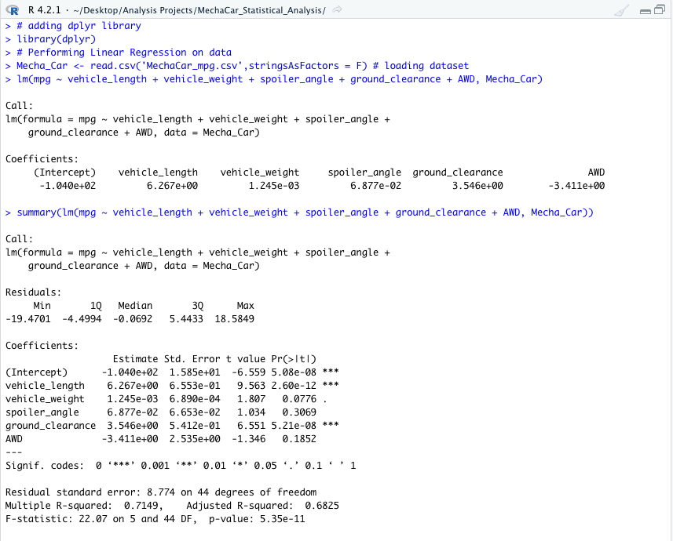
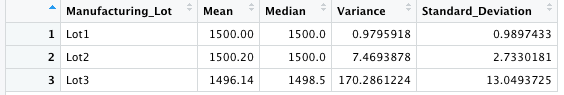
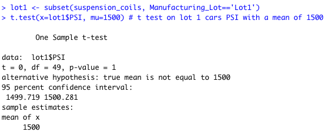
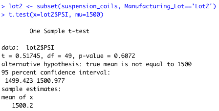
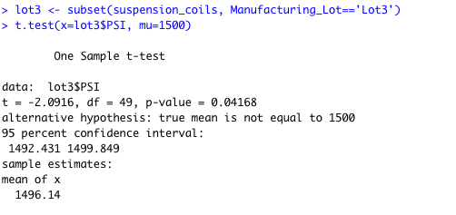
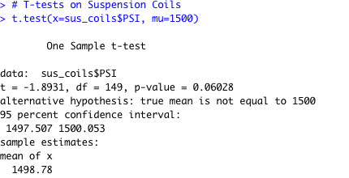

# MechaCar_Statistical_Analysis

## Overview
- I am reviewing the prodution data for AutoRU's manufacturing team in order to gain some insights on what has been blocking the production of the newest car prototype. The datasets they provided for us include Miles Per Gallon, and information on their suspension coils. I will be using a new program, R script and a few of its libraries in order to do this analysis.

## Linear Regression to Predict MPG
- The dependent variable is the MPG and we are trying to predict it by performing a linear regression. In this analysis the independent variables include the vehicle length, weight, AWD ,and the spoiler angel. 

1) Which variables/coefficients provided a non-random amount of variance to the mpg values in the dataset?

- The variables that provided a non-random amount of variance to the mpg values in the dataset were ground clearance and vehicle length. The p-value of these to variables were small which indicates that they obtain a high level of significance to the amount of gas spent. There were other variables that had a high significance, I just pointed out the promidant ones. 

2) Is the slope of the linear model considered to be zero? Why or why not?
 - No it is not because the dependent variable is affected significantly by some independent values. 
 
3) Does this linear model predict mpg of MechaCar prototypes effectively? Why or why not?

- During this analysis we found that the multiple rsquared is .7149 which would equate to about 71.5 percent confidence in the effectiveness of predicting the MPG of the MechaCar. Personally, I would finr it effective. But all depends on what is acceptable to the person reading it. 

### The MPG MLR

## Summary Statistics on suspension coils

-The first image includes the total summary and the second will include the lot summary

## Question about Summary statistics 

1) The design specifications for the MechaCar suspension coils dictate that the variance of the suspension coils must not exceed 100 pounds per square inch. Does the current manufacturing data meet this design specification for all manufacturing lots in total and each lot individually? Why or why not?

- As we can see in the above image only two of the three lots meet the specifications the third lot out does it by about 70 PSI. With the variance because 62.3 PSI we know that it does not meet our design specifications. 

## T-Tests on Suspension Coils

- Below I will attached the Population T-Test along with the 3 lot T-Test. THe point is to find if all the lots are diffrent from the mean PSI of the population of 1500 PSI.

- LOT ONE TTest

- LOT TWO TTest

- LOT THREE TTest

- Total Pop T-Test

# Study Design: MechaCar vs Competition

- In order to create a study to compare the MechaCar with other compettion, we have to look at what makes MechaCar better and more exciting for buyers than other competition. 

- Metrics to use: MPG on highway and city 

- null and alternative hypothesis: the alternative hypothesis is that when comparing the mechacar with competition will show that mechacar gives better MPG
the null would be that they are the same. 

- What test would be used: T-Test and Anova test 

- What data is needed: We need at least a sample of 1000 cars to get a good measure. 
